<div align="center">



</div>
<div align="center">


<p align="center">

</p>

<p align="center">


</p>

</div>

---

<table>
<tr>

<td width="60%" valign="top">

# 👨‍💻 About Me

Welcome to my **Developer Portfolio & Coding Journey** 👋

I'm a **Junior Backend .NET Developer** with a strong foundation in **Data Structures and Algorithms**. I leverage my problem-solving skills to build clean, scalable, and maintainable web applications using **C#**, **ASP.NET Core**, and **SQL Server**.

Passionate about writing quality code following **SOLID principles** and **Clean Architecture**, with complementary frontend experience in **Angular** and **Bootstrap** to support the full development cycle.

> *Building scalable systems and solving complex problems with a passion for efficient, elegant solutions.*

---

## 📈 Current Focus

```text
🌐 .NET Backend Development    ██████████████░ 95%
⚡ Data Structures & Algorithms █████████████░░ 90%
🤖 AI & LLM Integration        ████████░░░░░░░ 55%
📚 Continuous Learning         ██████████████ 100%
```

---

⭐ **If you like my work, don't forget to star this repository!**

</td>

<td width="40%" align="center">

<div align="center">



</div>

</td>

</tr>
</table>

---
---

<div align="center">


</div>

---

# 🌐 Connect With Me

<p align="center">

<a href="https://www.linkedin.com/in/ashraf3x">

</a>
&nbsp;
<a href="mailto:swe.ashraf3x@gmail.com">

</a>
&nbsp;
<a href="https://github.com/Ashraf3x">

</a>
&nbsp;
<a href="https://wa.me/201025811438">

</a>
&nbsp;
<a href="https://drive.google.com/file/d/1OvteKU3rOH6At5uIh7oqlgq8tRob3sGy/view?usp=drive_link">

</a>
&nbsp;


</p>

---
<div align="center">


</div>

# 💻 Tech Stack

<p align="center">


</p>

---

## 🛠️ Detailed Skills

### 🔤 Languages


### ⚙️ Backend & Architecture


### 🎨 Frontend


### 🗄️ Databases


### ☁️ Tools & DevOps


### 🤖 AI & LLMs


### 🧠 Personal Skills


---

# 🔥 GitHub Streak

<p align="center">
  
</p>


# 📈 Contribution Graph

<div align="center">


</div>

---


# 🚀 Featured Projects

| Project | Description | Tech |
|---------|-------------|------|
| 🦴 AI-Powered Medical Image Classification | Automated bone fracture classification from X-rays — 99%+ accuracy | Python, ResNet50, CNN, Computer Vision |
| 🏠 Real Estate Investment Platform | Fractional real estate with digital wallets, KYC, role-based dashboards & share marketplace | C#, ASP.NET Core 10, EF Core, SQL Server, MVC |
| 🎓 USC Student Platform | End-to-end academic management with Admin & Student modules, Clean Architecture | ASP.NET Core MVC, .NET 10, EF Core, SQL Server |

---

# 🏆 Competitive Programming

<p align="center">

<a href="https://codeforces.com/profile/Ashraf">

</a>
&nbsp;
<a href="https://leetcode.com/u/ashraf3x/">

</a>
&nbsp;
<a href="https://atcoder.jp/users/ahmed_ashraf11">

</a>
&nbsp;
<a href="https://vjudge.net/user/Ahmed_Ashraf11">

</a>

</p>

---

# 🏅 Achievements

```text
🥇  Specialist on Codeforces (Profile: Ashraf3x)
🏁  2x ECPC Finalist — 2023 & 2024
🥇  1st Team — University Qualification Contest 2023
🧩  Solved 2700+ Problems on Codeforces, LeetCode, Vjudge, AtCoder
👨‍🏫  Trained 250+ Students as Technical Head @ ICPC USC
```

---

# 🎓 Education & Experience

```text
📍 Information Technology Institute (ITI)
   Professional Diploma — 9-Month Web & BI-Infused CRM Program
   Oct 2025 – Present | Menoufia, Egypt

🎓 University of Sadat City
   B.Sc. Computer Science & Artificial Intelligence
   GPA: 3.3 / 4.0 — Grade: Very Good
   Oct 2021 – July 2025 | Sadat City, Egypt

👨‍💼 ICPC USC Community — Technical Head & Problem Solving Instructor
   Oct 2022 – Aug 2025
   • Trained 250+ students in DSA and Problem Solving
   • Managed full training cycle, curriculum, and problem setting
```

---

# ✍️ Random Dev Quote

<div align="center">


</div>

---

# 🐍 Contribution Snake

<picture>

<source media="(prefers-color-scheme: dark)"
  srcset="https://raw.githubusercontent.com/Ashraf3x/Ashraf3x/output/github-snake-dark.svg">

<source media="(prefers-color-scheme: light)"
  srcset="https://raw.githubusercontent.com/Ashraf3x/Ashraf3x/output/github-snake.svg">


</picture>

---

# 💡 Fun Fact

```text
while(alive){
    eat();
    sleep();
    code();
    solve_problems();
    repeat();
}
```

---

<div align="center">

### ⭐ Thanks for visiting my profile! ⭐

### 🚀 Let's Build Something Amazing Together!


</div>
